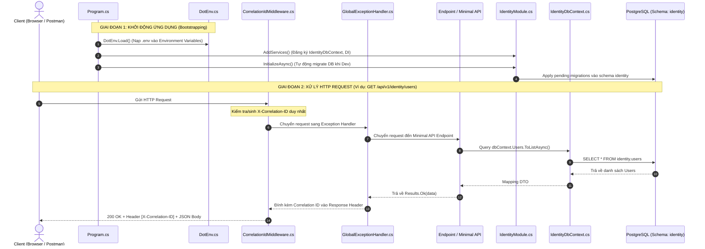

# Tài Liệu Chi Tiết Luồng Thực Thi Mã Nguồn (Codebase Runtime & Execution Flow)

> **Cập nhật triển khai 23/09/2026:** Các ví dụ direct-DbContext phía dưới mô tả bản khung cũ. Luồng hiện tại: `DotEnv` → đăng ký JWT/validation/module → migrate Identity + Catalog ở Development → exception/correlation/CORS/authentication/authorization/rate limiter → endpoint. Identity gọi MediatR handler; Catalog gọi `CatalogService`. Validation dự kiến trả `Result`/`ValidationError`, không ném `ValidationException`. API users quản trị yêu cầu role `Admin`; JWT được kiểm tra trạng thái tài khoản và security stamp. Chi tiết trạng thái đã/chưa làm: [backend-progress.md](backend-progress.md).

Tài liệu này giải thích chi tiết **vòng đời khởi động (Bootstrapping)** và **luồng xử lý một HTTP Request (Request Lifecycle)** qua từng file code trong hệ thống **SkillBridge API**.  
Mục đích: Giúp các lập trình viên mới vào dự án có thể đọc hiểu chính xác code chạy từ đâu, qua những middleware nào, và xử lý dữ liệu ra sao.

---

## 1. Bức Tranh Tổng Thể (Architectural Sequence)



---

## 2. Giai đoạn 1: Khởi động Ứng dụng (Bootstrapping Flow)

Toàn bộ quá trình khởi động bắt đầu từ file:  
👉 **[src/Bootstrapper/SkillBridge.Api/Program.cs](file:///d:/Projects/skillbridge-api/src/Bootstrapper/SkillBridge.Api/Program.cs)**

### Bước 1: Tự động nạp file `.env`
- **File thực thi**: [src/Bootstrapper/SkillBridge.Api/Common/DotEnv.cs](file:///d:/Projects/skillbridge-api/src/Bootstrapper/SkillBridge.Api/Common/DotEnv.cs)
- **Hành động**: `DotEnv.Load()` được gọi ở dòng đầu tiên của `Program.cs`.
  - Nó bắt đầu từ thư mục hiện tại, duyệt ngược lên các thư mục cha cho đến khi tìm thấy file `.env`.
  - Đọc các dòng cấu hình (như `ConnectionStrings__Database=...`, `RabbitMq__Host=...`) và gán vào biến môi trường hệ thống `Environment.SetEnvironmentVariable(...)`.
  - Nhờ đó, lập trình viên không cần cài đặt biến môi trường thủ công trên hệ điều hành.

### Bước 2: Khởi tạo Host & Cấu hình dịch vụ nền tảng
- **Dòng code**: `var builder = WebApplication.CreateBuilder(args);`
  - ASP.NET Core tự động đọc toàn bộ cấu hình từ `appsettings.json`, `appsettings.Development.json` và các biến môi trường vừa được `DotEnv` nạp.
- **Các dịch vụ toàn cục được nạp vào IoC Container**:
  - `builder.Services.AddProblemDetails()`: Kích hoạt chuẩn RFC 7807 cho lỗi API.
  - `builder.Services.AddExceptionHandler<GlobalExceptionHandler>()`: Đăng ký bộ bắt ngoại lệ tập trung ([GlobalExceptionHandler.cs](file:///d:/Projects/skillbridge-api/src/Bootstrapper/SkillBridge.Api/Middleware/GlobalExceptionHandler.cs)).
  - `builder.Services.AddOpenApi()`: Sinh tài liệu OpenAPI cho toàn bộ endpoint.
  - `builder.Services.AddCors(...)`: Cấu hình danh sách tên miền được phép gọi API (`Cors:AllowedOrigins`).
  - `builder.Services.AddHealthChecks()`: Tạo health check probe phục vụ Docker/Kubernetes.

### Bước 3: Đăng ký Bối cảnh Bảo mật & Enterprise BuildingBlocks
- **Dòng code**:
  ```csharp
  // 1. Bối cảnh người dùng hiện tại (ICurrentUser)
  builder.Services.AddHttpContextAccessor();
  builder.Services.AddScoped<ICurrentUser, CurrentUser>();

  // 2. Toàn bộ 10 Bounded Context Modules
  List<IModule> modules = [
      new IdentityModule(),
      new ProfilesModule(),
      new CatalogModule(),
      new SchedulingModule(),
      new BookingModule(),
      new PaymentsModule(),
      new LearningModule(),
      new MessagingModule(),
      new ReviewsModule(),
      new RecommendationsModule()
  ];

  // 3. Đăng ký tập trung Enterprise BuildingBlocks
  var moduleAssemblies = modules.Select(m => m.GetType().Assembly).Distinct().ToArray();
  builder.Services.AddBuildingBlocks(builder.Configuration, moduleAssemblies);
  ```
- **Hành động**:
  - `AddBuildingBlocks`:
    - Đăng ký `TimeProvider.System` chuẩn hóa thời gian.
    - Đăng ký `MediatR` quét toàn bộ Handler trong 10 assemblies module.
    - Kích hoạt `LoggingBehavior` (đo hiệu năng) và `ValidationBehavior` (tự động chạy FluentValidation trước khi vào Handler).
    - Đăng ký `IEventBus` -> `InMemoryEventBus` cho giao tiếp phi đồng bộ liên module.
    - Đăng ký `AuditInterceptor` và `DispatchDomainEventsInterceptor` cho EF Core.

### Bước 4: Đăng ký Dependency Injection cho từng Module
- **Dòng code**:
  ```csharp
  foreach (var module in modules)
  {
      module.AddServices(builder.Services, builder.Configuration);
  }
  ```
- **Hành động**: Mỗi module độc lập đăng ký DbContext và services của riêng mình trong IoC Container mà không dính líu đến module khác.

### Bước 5: Xây dựng HTTP Middleware Pipeline
- **Dòng code**: `var app = builder.Build();`
- **Các Middleware được xâu chuỗi theo thứ tự**:
  1. `app.UseExceptionHandler()`: Lớp bọc ngoài cùng. Bắt mọi exception (kể cả `ValidationException` từ FluentValidation) và chuyển cho `GlobalExceptionHandler`.
  2. `app.UseMiddleware<CorrelationIdMiddleware>()`: Gán mã định danh duy nhất cho request (`X-Correlation-ID`).
  3. `app.UseCors("Default")`: Kiểm tra chính sách CORS.
  4. Nếu ở môi trường `Development`:
     - Bật OpenAPI: `app.MapOpenApi()`.
     - Kích hoạt giao diện UI tài liệu: `app.MapScalarApiReference()`.
     - **Khởi tạo Module độc lập**: Lặp qua các module và gọi `await module.InitializeAsync(app.Services)` để tự kiểm tra/migrate DB.

### Bước 6: Map Endpoints của từng Module & Lắng nghe Request
- **Dòng code**:
  ```csharp
  foreach (var module in modules)
  {
      module.MapEndpoints(app);
  }
  app.Run();
  ```
- Mỗi module tự đăng ký các Minimal API của mình:
  - Base class [ModuleDefinition.cs](file:///d:/Projects/skillbridge-api/src/BuildingBlocks/SkillBridge.BuildingBlocks/Contracts/ModuleDefinition.cs) tạo sẵn endpoint probe: `GET /api/v1/{routePrefix}/_module`.
  - [IdentityModule.cs](file:///d:/Projects/skillbridge-api/src/Modules/Identity/SkillBridge.Modules.Identity/IdentityModule.cs) đăng ký thêm:
    - `GET /api/v1/identity/users/me`
    - `GET /api/v1/identity/users`

---

## 3. Giai đoạn 2: Luồng Xử lý một HTTP Request (Request Execution Flow)

Giả sử Client gửi một request:  
👉 **`GET http://localhost:5000/api/v1/identity/users`**

### 1. Request đi vào `CorrelationIdMiddleware`
- **File**: [src/Bootstrapper/SkillBridge.Api/Middleware/CorrelationIdMiddleware.cs](file:///d:/Projects/skillbridge-api/src/Bootstrapper/SkillBridge.Api/Middleware/CorrelationIdMiddleware.cs)
- **Logic**:
  - Middleware kiểm tra xem Client có gửi kèm header `X-Correlation-ID` hay không.
  - Nếu không có: Sinh một GUID ngẫu nhiên không có dấu gạch ngang (ví dụ: `a1b2c3d4e5...`) và gán vào `context.Request.Headers["X-Correlation-ID"]`.
  - Đăng ký callback `context.Response.OnStarting`: đảm bảo trước khi gửi response về client, Response Header cũng sẽ có `X-Correlation-ID: a1b2c3d4e5...`.
  - Chuyển quyền xử lý cho middleware tiếp theo (`await _next(context)`).

### 2. Request đi qua `GlobalExceptionHandler`
- **File**: [src/Bootstrapper/SkillBridge.Api/Middleware/GlobalExceptionHandler.cs](file:///d:/Projects/skillbridge-api/src/Bootstrapper/SkillBridge.Api/Middleware/GlobalExceptionHandler.cs)
- **Logic**:
  - Đóng vai trò là chốt chặn bảo vệ cuối cùng.
  - Nếu toàn bộ luồng xử lý bên trong chạy bình thường: Nó không can thiệp.
  - Nếu có unhandled Exception xảy ra:
    - Ghi log lỗi ra console/file kèm theo Correlation ID.
    - Tạo object `ProblemDetails` theo chuẩn RFC 7807 (gồm status code 500, title "Server Error", path và extension `correlationId`).
    - Trả về JSON cho client mà không để lộ stack trace nhạy cảm của hệ thống.

### 3. Request đến Endpoint Delegate (Minimal API)
- **File**: [src/Modules/Identity/SkillBridge.Modules.Identity/IdentityModule.cs](file:///d:/Projects/skillbridge-api/src/Modules/Identity/SkillBridge.Modules.Identity/IdentityModule.cs)
- **Đoạn code thực thi**:
  ```csharp
  group.MapGet("/users", async (IdentityDbContext dbContext) =>
  {
      var users = await dbContext.Users
          .AsNoTracking()
          .Select(u => new
          {
              u.Id,
              u.Email,
              u.FullName,
              u.Role,
              u.IsActive,
              u.CreatedAtUtc
          })
          .ToListAsync();

      return Microsoft.AspNetCore.Http.Results.Ok(users);
  });
  ```
- **Các bước chi tiết**:
  1. ASP.NET Core Router phân giải đường dẫn khớp với template `/api/v1/identity/users`.
  2. DI Container tự động inject instance `IdentityDbContext` vào lambda function.
  3. `IdentityDbContext` sử dụng `UserConfiguration` ([UserConfiguration.cs](file:///d:/Projects/skillbridge-api/src/Modules/Identity/SkillBridge.Modules.Identity/Infrastructure/Data/Configurations/UserConfiguration.cs)) để biết bảng cần truy vấn là `identity.users`.
  4. Câu lệnh SQL được sinh ra:  
     `SELECT id, email, full_name, role, is_active, created_at_utc FROM identity.users;`
  5. Dữ liệu được trả về và đóng gói thành `Results.Ok(users)`.

### 4. Phản hồi trả về Client
- Response đi ngược qua các middleware.
- `CorrelationIdMiddleware` gắn header `X-Correlation-ID: a1b2c3d4...`.
- Client nhận được:
  - **HTTP Status**: `200 OK`
  - **Headers**: `Content-Type: application/json`, `X-Correlation-ID: ...`
  - **Body**: Danh sách JSON của người dùng.

---

## 4. Tóm tắt Vai Trò của Từng File Code Trong Hệ Thống

| Đường dẫn File | Tầng | Vai trò chính |
| :--- | :--- | :--- |
| **`Program.cs`** | `Bootstrapper` | Điểm khởi đầu ứng dụng, nạp `.env`, cấu hình DI, middleware pipeline, kích hoạt 10 modules. |
| **`Common/DotEnv.cs`** | `Bootstrapper` | Bộ quét và nạp file `.env` cục bộ vào biến môi trường hệ thống. |
| **`Common/CurrentUser.cs`** | `Bootstrapper` | Triển khai `ICurrentUser` lấy UserId, Email, Role từ `IHttpContextAccessor`. |
| **`Middleware/CorrelationIdMiddleware.cs`** | `Bootstrapper` | Tạo và truyền mã `X-Correlation-ID` xuyên suốt request/response để truy vết log. |
| **`Middleware/GlobalExceptionHandler.cs`** | `Bootstrapper` | Bắt ngoại lệ tập trung, xử lý `ValidationException` và lỗi 500 chuẩn RFC 7807 `ProblemDetails`. |
| **`Contracts/IModule.cs` & `ModuleDefinition.cs`** | `BuildingBlocks` | Hợp đồng vòng đời module (`AddServices`, `MapEndpoints`, `InitializeAsync`) và endpoint probe `/_module`. |
| **`CQRS/ICommand.cs` & `IQuery.cs`** | `BuildingBlocks` | Giao diện Command/Query chuẩn hóa CQRS gắn liền với Railway `Result` / `Result<T>`. |
| **`Behaviors/ValidationBehavior.cs`** | `BuildingBlocks` | MediatR pipeline tự động chạy FluentValidation trước khi gọi Handler. |
| **`Behaviors/LoggingBehavior.cs`** | `BuildingBlocks` | MediatR pipeline đo thời gian thực thi, cảnh báo request chạy chậm (> 500ms). |
| **`Security/ICurrentUser.cs`** | `BuildingBlocks` | Hợp đồng lấy bối cảnh người dùng đăng nhập không phụ thuộc `HttpContext`. |
| **`Domain/Entity.cs` & `AggregateRoot.cs`** | `BuildingBlocks` | Lớp cơ sở DDD: so sánh định danh Id và thu thập sự kiện miền `DomainEvents`. |
| **`Domain/AuditableEntity.cs`** | `BuildingBlocks` | Base Entity hỗ trợ audit (`CreatedAt`, `CreatedBy`, `UpdatedAt`, `UpdatedBy`) và xóa mềm. |
| **`Infrastructure/Interceptors/AuditInterceptor.cs`** | `BuildingBlocks` | EF Core interceptor tự động điền thời gian UTC và UserId khi `SaveChanges`. |
| **`Infrastructure/Interceptors/DispatchDomainEventsInterceptor.cs`** | `BuildingBlocks` | EF Core interceptor tự động thu thập và phát domain events qua MediatR. |
| **`Events/IIntegrationEvent.cs` & `IEventBus.cs`** | `BuildingBlocks` | Hợp đồng giao tiếp bất đồng bộ liên module (hiện thực in-memory hoặc message broker). |
| **`Pagination/PagedResult.cs`** | `BuildingBlocks` | Đối tượng phản hồi phân trang chuẩn thống nhất format JSON cho cả 10 modules. |
| **`Results/Result.cs` & `ResultExtensions.cs`** | `BuildingBlocks` | Railway-Oriented Programming và helper chuyển đổi Result sang Minimal API `IResult`. |
| **`Extensions/BuildingBlocksExtensions.cs`** | `BuildingBlocks` | Extension method đăng ký tập trung toàn bộ MediatR, FluentValidation, Interceptors, EventBus. |
| **`src/Modules/*/{Name}Module.cs`** | `Modules` | Triển khai 10 Bounded Contexts độc lập (`Identity`, `Profiles`, `Catalog`, `Scheduling`, `Booking`, `Payments`, `Learning`, `Messaging`, `Reviews`, `Recommendations`). |
