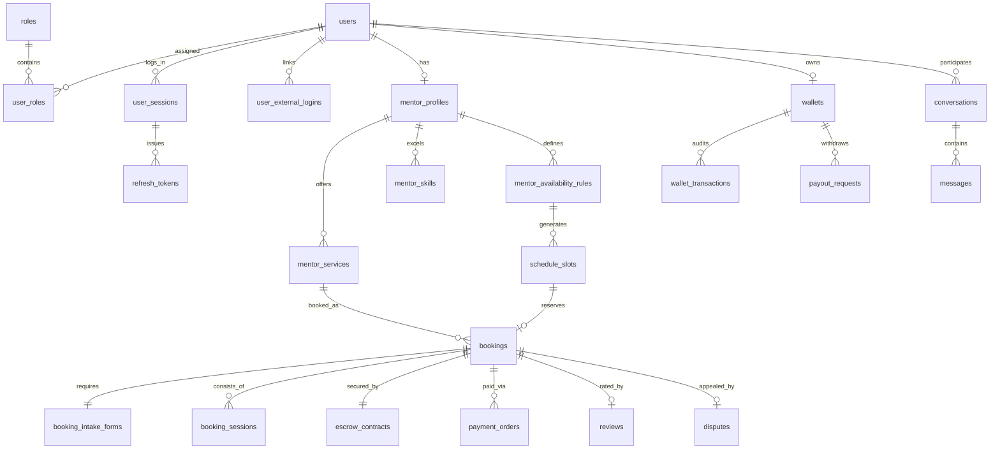

# Thiết Kế Cơ Sở Dữ Liệu Chuẩn Doanh Nghiệp (Enterprise Database Blueprint)

> Đây là thiết kế mục tiêu. Database hiện tại do EF migrations quản lý; Docker init chỉ tạo schema. Xem [trạng thái triển khai và lưu ý nâng cấp](backend-progress.md).

Tài liệu này cung cấp thiết kế chi tiết toàn bộ kiến trúc Cơ sở dữ liệu PostgreSQL cho 7 Bounded Contexts (24 Bảng Chuyên Trách) của nền tảng **SkillBridge**.  
Toàn bộ mã DDL SQL đã được chuẩn hóa và quản lý bằng EF Core Migrations phân lập ranh giới.

---

## 1. Các Trụ Cột Thiết Kế Chuẩn Doanh Nghiệp (Enterprise Design Pillars)

1. **Cô lập Bounded Context (Schema Isolation & Decoupled GUIDs)**:  
   Mỗi module sở hữu riêng một PostgreSQL schema. Tuyệt đối **không dùng chung bảng hay khóa ngoại vật lý liên schema**. Giao tiếp hoàn toàn bằng GUIDv7.
2. **Mô Hình Đóng Gói Kết Quả (Productized Services & Intake Form)**:  
   Bảng `mentor_services` quản lý các gói dịch vụ cụ thể (Review CV, Mock Interview, Khóa học dài hạn) và bảng `booking_intake_forms` lưu 3 câu hỏi khảo sát bắt buộc.
3. **Sổ Cái Kế Toán Kép (Double-Entry Ledger) & Hợp Đồng Escrow Cột Mốc**:  
   Module `payments` quản lý qua **Sổ cái giao dịch ví (Wallet Ledger)** và **Hợp đồng tạm giữ Escrow đa mốc (Milestone Escrow)**.
4. **Thanh Toán Đôi Chuẩn Fintech (Dual Payment Gateway)**:  
   Bảng `payment_orders` hỗ trợ cả 2 cổng `VNPAY` và `PAYOS` kèm chữ ký số và bảng `payment_webhooks_audit` chống tấn công Replay Attack.
5. **An Toàn Phiên & Thiết Bị (Zero-Token & Device Management)**:  
   Bảng `user_sessions` và `refresh_tokens` (băm SHA-256) hỗ trợ xem danh sách thiết bị và nút đăng xuất từ xa.
6. **Bảo Vệ Khỏi Race Condition**:  
   Slot thời gian áp dụng Khóa nguyên tử Redis 10 phút (`SET NX EX`) và Database Transaction `SELECT FOR UPDATE` khi giải ngân hoặc hoàn tiền.

---

## 2. Sơ Đồ Thực Thể Liên Kết (ERD) 7 Phân Hệ

---

## 3. Danh Mục Chi Tiết 24 Bảng CSDL Theo 7 Bounded Contexts

### PHÂN HỆ 1: IDENTITY & PHÂN QUYỀN RBAC (`identity.*`)
1. **`users`**: `id (UUIDv7 PK)`, `email`, `password_hash`, `full_name`, `avatar_url`, `is_email_verified`, `status`, `created_at_utc`.
2. **`roles`**: `id`, `name` (`Mentee`, `Mentor`, `SuperAdmin`, `DisputeMod`, `FinanceAdmin`), `code`, `description`.
3. **`user_roles`**: `user_id`, `role_id`, `assigned_at_utc` (Hỗ trợ 1 tài khoản vừa học vừa dạy).
4. **`user_external_logins`**: `id`, `user_id`, `provider` (Google, GitHub), `provider_user_id`, `created_at_utc`.

### PHÂN HỆ 2: SESSIONS & THIẾT BỊ BẢO MẬT (`identity.*`)
5. **`user_sessions`**: `id`, `user_id`, `device_name`, `ip_address`, `user_agent`, `is_active`, `last_active_at_utc`, `created_at_utc`.
6. **`refresh_tokens`**: `id`, `session_id`, `token_hash` (SHA-256), `expires_at_utc`, `is_revoked`, `replaced_by_token_id`.

### PHÂN HỆ 3: HỒ SƠ MENTOR, GÓI DỊCH VỤ & KỸ NĂNG (`profiles.*`, `catalog.*`)
7. **`mentor_profiles`**: `mentor_id`, `headline`, `bio`, `meet_link`, `verification_status` (`Unverified`/`Pending`/`Verified`), `kyc_documents`, `monthly_strikes`.
8. **`mentor_services`**: `id`, `mentor_id`, `title`, `description`, `service_type` (`ReviewCV`, `MockInterview`, `Roadmap`), `total_sessions`, `price`, `is_active`.
9. **`skills`**: `id`, `name` (React, .NET, Docker, Microservices, System Design), `slug`, `category_id`.
10. **`mentor_skills`**: `mentor_id`, `skill_id`, `years_of_experience` (Phục vụ lọc tìm kiếm siêu tốc).

### PHÂN HỆ 4: SCHEDULING - LỊCH BIỂU & GIỮ CHỖ (`scheduling.*`)
11. **`mentor_availability_rules`**: `id`, `mentor_id`, `day_of_week` (0-6), `start_time`, `end_time` (Khung giờ rảnh lặp lại).
12. **`schedule_slots`**: `id`, `mentor_id`, `start_time_utc`, `end_time_utc`, `status` (`Available`/`Held`/`Booked`), `held_until_utc` (Hạn chót 10 phút).

### PHÂN HỆ 5: BOOKINGS & HỌC TẬP (`booking.*`, `learning.*`)
13. **`bookings`**: `id`, `booking_code`, `service_id`, `mentee_id`, `mentor_id`, `total_amount`, `status` (`Pending`/`Confirmed`/`Completed`/`Disputed`).
14. **`booking_intake_forms`**: `id`, `booking_id`, `core_question`, `attached_links` (CV/GitHub), `target_goals_60m`.
15. **`booking_sessions`**: `id`, `booking_id`, `slot_id`, `session_number` (Buổi 1/5, 2/5...), `status`, `proof_image_url`, `mentee_joined_at`, `mentor_joined_at`.

### PHÂN HỆ 6: PAYMENTS, DUAL ESCROW & VÍ (`payments.*`)
16. **`wallets`**: `id`, `user_id`, `available_balance`, `held_balance`, `currency`, `updated_at_utc`.
17. **`wallet_transactions`**: `id`, `wallet_id`, `type` (`Deposit`/`EscrowHold`/`EscrowRelease`/`Refund`/`Payout`), `amount`, `balance_before`, `balance_after`.
18. **`payment_orders`**: `id`, `order_code`, `gateway` (`VNPAY`/`PAYOS`), `payment_method`, `qr_content`, `status` (`Pending`/`Paid`/`Cancelled`/`Expired`), `gateway_order_id`, `expired_at`.
19. **`payment_webhooks_audit`**: `id`, `gateway`, `event_type`, `payload_json`, `signature`, `is_valid`, `processed_at_utc` (Chống replay attack).
20. **`escrow_contracts`**: `id`, `booking_id`, `total_amount`, `platform_fee`, `status` (`Holding`/`PartiallyReleased`/`FullyReleased`), `total_milestones`, `released_milestones`, `released_amount`.
21. **`payout_requests`**: `id`, `payout_code`, `mentor_id`, `amount`, `bank_fee`, `net_amount`, `bank_code`, `account_number`, `account_holder_name`, `status`, `otp_verified`.

### PHÂN HỆ 7: TRUST, PHÁN XỬ & BẢO VỆ NIỀM TIN (`reviews.*`, `messaging.*`)
22. **`reviews`**: `id`, `booking_id`, `rating` (1-5 sao), `comment`, `is_long_term` (Huy hiệu VIP $\ge$ 5 buổi), `mentor_reply`.
23. **`disputes`**: `id`, `booking_id`, `raised_by_user_id`, `reason_category`, `mentee_evidence`, `mentor_rebuttal`, `admin_ruling`, `resolved_at`.
24. **`conversations` & `messages`**: `id`, `participant_ids`, `content`, `is_flagged_for_leakage` (Bắt cờ tự động khi chat SĐT/Zalo chống ăn mảnh).
