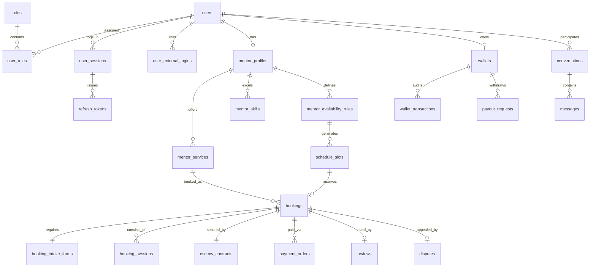

# Thiết Kế Cơ Sở Dữ Liệu Chuẩn Doanh Nghiệp (Enterprise Database Blueprint)

Tài liệu này cung cấp thiết kế chi tiết toàn bộ kiến trúc Cơ sở dữ liệu PostgreSQL cho 10 Bounded Contexts (46 Bảng Chuyên Trách) của nền tảng **SkillBridge**.  
Toàn bộ mã DDL SQL đã được chuẩn hóa và quản lý bằng EF Core Migrations phân lập ranh giới.

---

## 1. Các Trụ Cột Thiết Kế Chuẩn Doanh Nghiệp (Enterprise Design Pillars)

1. **Cô lập Bounded Context (Schema Isolation & Decoupled GUIDs)**:  
   Mỗi module sở hữu riêng một PostgreSQL schema. Tuyệt đối **không dùng chung bảng hay khóa ngoại vật lý liên schema**. Giao tiếp hoàn toàn bằng GUIDv7.
2. **Mô Hình Đóng Gói Kết Quả (Productized Services & Intake Form)**:  
   Bảng `mentor_services` quản lý các gói dịch vụ cụ thể (Review CV, Mock Interview, Khóa học dài hạn) và bảng `booking_intake_forms` lưu 3 câu hỏi khảo sát bắt buộc.
3. **Sổ Cái Kế Toán Kép (Double-Entry Ledger) & Hợp Đồng Escrow Cột Mốc**:  
   Module `payments` quản lý qua **Sổ cái giao dịch ví (Wallet Ledger)** và **Hợp đồng tạm giữ Escrow đa mốc (Milestone Escrow)**.
4. **Thanh Toán Đôi Chuẩn Fintech (Dual Payment Gateway)**:  
   Bảng `payment_orders` hỗ trợ cả 2 cổng `VNPAY` và `PAYOS` kèm chữ ký số và bảng `payment_webhooks_audit` chống tấn công Replay Attack.
5. **An Toàn Phiên & Thiết Bị (Zero-Token & Device Management)**:  
   Bảng `user_sessions` và `refresh_tokens` (băm SHA-256) hỗ trợ xem danh sách thiết bị và nút đăng xuất từ xa.
6. **Bảo Vệ Khỏi Race Condition**:  
   Slot thời gian áp dụng Khóa nguyên tử Redis 10 phút (`SET NX EX`) và Database Transaction `SELECT FOR UPDATE` khi giải ngân hoặc hoàn tiền.

---

## 2. Sơ Đồ Thực Thể Liên Kết (ERD) 7 Phân Hệ

---

## 3. Danh Mục Chi Tiết 46 Bảng CSDL Theo 10 PostgreSQL Schemas

### 1. SCHEMA IDENTITY (`identity.*`) - 5 Bảng
1. **`roles`**: `id (UUID PK)`, `name` (`Admin`, `Mentor`, `Mentee`), `normalized_name`, `description`.
2. **`users`**: `id (UUID PK)`, `email`, `normalized_email`, `password_hash`, `security_stamp`, `full_name`, `phone_number`, `avatar_url`, `is_email_confirmed`, `is_phone_confirmed`, `two_factor_enabled`, `lockout_end_utc`, `lockout_enabled`, `access_failed_count`, `role`, `is_active`, `created_at_utc`, `updated_at_utc`.
3. **`user_roles`**: `user_id (FK users)`, `role_id (FK roles)`, `PRIMARY KEY (user_id, role_id)`.
4. **`refresh_tokens`**: `id`, `user_id (FK users)`, `token`, `expires_at_utc`, `revoked_at_utc`, `replaced_by_token`, `created_by_ip`, `created_at_utc`.
5. **`external_logins`**: `id`, `user_id (FK users)`, `provider` (`Google`, `GitHub`), `provider_key`, `provider_display_name`, `created_at_utc`.

### 2. SCHEMA PROFILES (`profiles.*`) - 5 Bảng
6. **`mentor_profiles`**: `id (UUID PK)`, `user_id (Decoupled GUID)`, `headline`, `bio`, `hourly_rate`, `currency`, `timezone`, `years_of_experience`, `video_intro_url`, `github_url`, `linkedin_url`, `website_url`, `is_verified`, `verification_status`, `rating_average`, `total_reviews`, `total_mentees`, `total_sessions`, `is_accepting_mentees`, `created_at_utc`.
7. **`mentee_profiles`**: `id`, `user_id (Decoupled GUID)`, `headline`, `career_goal`, `current_level`, `timezone`, `budget_min`, `budget_max`, `created_at_utc`.
8. **`mentor_skills`**: `id`, `mentor_profile_id (FK)`, `skill_id (Decoupled GUID)`, `skill_name`, `proficiency_level`, `years_of_experience`, `is_primary`.
9. **`mentor_experiences`**: `id`, `mentor_profile_id (FK)`, `company_name`, `position`, `start_date`, `end_date`, `is_current`, `description`.
10. **`mentor_certifications`**: `id`, `mentor_profile_id (FK)`, `name`, `issuing_organization`, `issue_date`, `expiration_date`, `credential_url`.

### 3. SCHEMA CATALOG (`catalog.*`) - 5 Bảng
11. **`categories`**: `id (UUID PK)`, `parent_id (Self-FK NULL)`, `name`, `slug`, `icon_url`, `display_order`, `is_active`.
12. **`skills`**: `id`, `category_id (FK)`, `name`, `slug`, `description`, `icon_url`, `is_popular`, `is_active`.
13. **`tags`**: `id`, `name`, `slug`.
14. **`skill_tags`**: `skill_id (FK)`, `tag_id (FK)`, `PRIMARY KEY (skill_id, tag_id)`.
15. **`mentor_services`**: `id`, `mentor_id (Decoupled GUID)`, `title`, `description`, `service_type` (`Tier1_ReviewCV`, `Tier2_MockInterview`, `Tier3_Roadmap`), `duration_minutes`, `price`, `currency`, `total_sessions`, `deliverables`, `is_active`, `created_at_utc`.

### 4. SCHEMA SCHEDULING (`scheduling.*`) - 4 Bảng
16. **`scheduling_settings`**: `id`, `mentor_id (Decoupled GUID)`, `slot_duration_minutes`, `buffer_time_minutes`, `min_notice_hours`, `max_advance_booking_days`, `is_auto_accept`.
17. **`availability_rules`**: `id`, `mentor_id (Decoupled GUID)`, `day_of_week` (0-6), `start_time`, `end_time`, `is_active`.
18. **`schedule_slots`**: `id`, `mentor_id (Decoupled GUID)`, `start_time_utc`, `end_time_utc`, `status` (`Available`, `Held`, `Booked`, `Locked`), `held_until_utc`, `created_at_utc`.
19. **`time_offs`**: `id`, `mentor_id (Decoupled GUID)`, `start_time_utc`, `end_time_utc`, `reason`, `created_at_utc`.

### 5. SCHEMA BOOKING (`booking.*`) - 5 Bảng
20. **`bookings`**: `id (UUID PK)`, `booking_code`, `service_id (Decoupled GUID)`, `mentee_id (Decoupled GUID)`, `mentor_id (Decoupled GUID)`, `total_amount`, `currency`, `status` (`Draft`, `PendingPayment`, `Confirmed`, `InProgress`, `Completed`, `Cancelled`, `Refunded`, `Disputed`), `cancellation_reason`, `created_at_utc`.
21. **`booking_intake_forms`**: `id`, `booking_id (FK)`, `core_question`, `attached_links`, `target_goals_60m`, `created_at_utc`.
22. **`booking_sessions`**: `id`, `booking_id (FK)`, `slot_id (Decoupled GUID)`, `session_number`, `status`, `proof_image_url`, `mentee_joined_at`, `mentor_joined_at`, `notes`.
23. **`reschedule_requests`**: `id`, `booking_id (FK)`, `requested_by (Decoupled GUID)`, `old_slot_id`, `new_slot_id`, `reason`, `status` (`Pending`, `Accepted`, `Rejected`).
24. **`booking_audit_logs`**: `id`, `booking_id (FK)`, `actor_id`, `action`, `from_status`, `to_status`, `note`, `created_at_utc`.

### 6. SCHEMA PAYMENTS (`payments.*`) - 6 Bảng
25. **`wallets`**: `id (UUID PK)`, `user_id (Decoupled GUID)`, `available_balance`, `held_balance`, `currency`, `updated_at_utc`.
26. **`wallet_transactions`**: `id`, `wallet_id (FK)`, `type` (`Deposit`, `EscrowHold`, `EscrowRelease`, `Refund`, `Payout`), `amount`, `balance_before`, `balance_after`, `reference_id`, `description`, `created_at_utc`.
27. **`payment_orders`**: `id`, `order_code`, `booking_id (Decoupled GUID)`, `user_id (Decoupled GUID)`, `amount`, `currency`, `gateway` (`PAYOS`, `VNPAY`), `payment_method`, `qr_content`, `status` (`Pending`, `Paid`, `Cancelled`, `Expired`), `gateway_transaction_id`, `expired_at_utc`.
28. **`payment_webhooks_audit`**: `id`, `gateway`, `event_type`, `payload_json`, `signature`, `is_valid`, `error_message`, `processed_at_utc`.
29. **`escrow_contracts`**: `id`, `booking_id (Decoupled GUID)`, `total_amount`, `platform_fee`, `status` (`Holding`, `PartiallyReleased`, `FullyReleased`, `Refunded`), `total_milestones`, `released_milestones`, `released_amount`, `dispute_deadline_utc`.
30. **`payout_requests`**: `id`, `payout_code`, `mentor_id (Decoupled GUID)`, `amount`, `bank_fee`, `net_amount`, `bank_code`, `account_number`, `account_holder_name`, `status` (`Pending`, `Approved`, `Processing`, `Completed`, `Rejected`), `otp_verified`, `created_at_utc`.

### 7. SCHEMA LEARNING (`learning.*`) - 5 Bảng
31. **`learning_sessions`**: `id (UUID PK)`, `booking_session_id (Decoupled GUID)`, `mentor_id (Decoupled GUID)`, `mentee_id (Decoupled GUID)`, `title`, `room_url`, `status` (`Scheduled`, `InProgress`, `Completed`, `NoShow`), `start_time_utc`, `end_time_utc`.
32. **`session_attendances`**: `id`, `session_id (FK)`, `user_id (Decoupled GUID)`, `role` (`Mentor`, `Mentee`), `joined_at_utc`, `left_at_utc`, `duration_minutes`.
33. **`session_notes`**: `id`, `session_id (FK)`, `author_id (Decoupled GUID)`, `content`, `is_private`, `created_at_utc`, `updated_at_utc`.
34. **`session_materials`**: `id`, `session_id (FK)`, `uploaded_by (Decoupled GUID)`, `title`, `file_url`, `file_type`, `file_size_bytes`, `created_at_utc`.
35. **`session_action_items`**: `id`, `session_id (FK)`, `mentor_id (Decoupled GUID)`, `mentee_id (Decoupled GUID)`, `task_description`, `due_date_utc`, `is_completed`, `completed_at_utc`.

### 8. SCHEMA MESSAGING (`messaging.*`) - 5 Bảng
36. **`conversations`**: `id (UUID PK)`, `created_at_utc`, `last_message_at_utc`, `is_flagged_for_leakage`.
37. **`conversation_participants`**: `conversation_id (FK)`, `user_id (Decoupled GUID)`, `joined_at_utc`, `last_read_message_id`, `PRIMARY KEY (conversation_id, user_id)`.
38. **`messages`**: `id (UUID PK)`, `conversation_id (FK)`, `sender_id (Decoupled GUID)`, `content`, `message_type` (`Text`, `Attachment`, `SessionInvite`), `is_flagged_for_leakage`, `created_at_utc`.
39. **`message_reads`**: `message_id (FK)`, `user_id (Decoupled GUID)`, `read_at_utc`, `PRIMARY KEY (message_id, user_id)`.
40. **`message_attachments`**: `id`, `message_id (FK)`, `file_name`, `file_url`, `file_type`, `file_size_bytes`.

### 9. SCHEMA REVIEWS (`reviews.*`) - 3 Bảng
41. **`reviews`**: `id (UUID PK)`, `booking_id (Decoupled GUID)`, `mentee_id (Decoupled GUID)`, `mentor_id (Decoupled GUID)`, `overall_rating` (1-5), `communication_rating` (1-5), `expertise_rating` (1-5), `helpfulness_rating` (1-5), `comment`, `is_long_term`, `mentor_reply`, `mentor_replied_at_utc`, `created_at_utc`.
42. **`mentor_rating_summaries`**: `mentor_id (Decoupled GUID PK)`, `total_reviews`, `average_rating`, `five_star_count`, `four_star_count`, `three_star_count`, `two_star_count`, `one_star_count`, `updated_at_utc`.
43. **`disputes`**: `id (UUID PK)`, `booking_id (Decoupled GUID)`, `raised_by_user_id (Decoupled GUID)`, `reason_category`, `mentee_evidence`, `mentor_rebuttal`, `admin_ruling` (`RefundMentee`, `ReleaseMentor`, `SplitPartial`), `admin_id`, `status` (`Pending`, `Reviewing`, `Resolved`, `Dismissed`), `resolved_at_utc`.

### 10. SCHEMA RECOMMENDATIONS (`recommendations.*`) - 3 Bảng
44. **`mentor_recommendation_metrics`**: `mentor_id (Decoupled GUID PK)`, `completion_rate`, `acceptance_rate`, `response_time_minutes`, `recommendation_score`, `updated_at_utc`.
45. **`mentee_interaction_logs`**: `id (UUID PK)`, `mentee_id (Decoupled GUID)`, `target_mentor_id`, `interaction_type` (`ViewProfile`, `ClickService`, `InitiateBooking`), `created_at_utc`.
46. **`recommendation_logs`**: `id (UUID PK)`, `mentee_id (Decoupled GUID)`, `recommended_mentor_ids` (JSONB/Array), `algorithm_version`, `created_at_utc`.
