# Thiết Kế Cơ Sở Dữ Liệu Chuẩn Doanh Nghiệp (Enterprise Database Blueprint)

Tài liệu này cung cấp thiết kế chi tiết toàn bộ kiến trúc Cơ sở dữ liệu PostgreSQL cho 10 Bounded Contexts của nền tảng **SkillBridge**.  
Toàn bộ mã DDL SQL đã được nạp sẵn vào file: 👉 [scripts/init-db/01-init-schemas.sql](file:///d:/Projects/skillbridge-api/scripts/init-db/01-init-schemas.sql)

---

## 1. Các Trụ Cột Thiết Kế Chuẩn Doanh Nghiệp (Enterprise Design Pillars)

1. **Cô lập Bounded Context (Schema Isolation)**:  
   Mỗi module sở hữu riêng một PostgreSQL schema. Tuyệt đối **không dùng chung bảng hay khóa ngoại vật lý liên schema**.
2. **Sổ Cái Kế Toán Kép (Double-Entry Ledger) & Hợp Đồng Escrow**:  
   Module `payments` không chỉ lưu số dư `balance` đơn thuần mà quản lý qua **Sổ cái giao dịch ví (Wallet Ledger)** và **Hợp đồng tạm giữ (Escrow Contract)** để bảo vệ tiền của Mentee và quyền lợi của Mentor.
3. **Quản lý Đa Múi Giờ Chuẩn Quốc Tế (Timezone Awareness)**:  
   Toàn bộ bảng `profiles` và `scheduling` đều lưu trường `timezone` (ví dụ: `Asia/Ho_Chi_Minh`, `America/New_York`), đảm bảo việc tính toán lịch trống và đổi giờ sang `TIMESTAMPTZ` (UTC) không bị lệch lịch.
4. **State Machine & Nhật Ký Kiểm Toán (Audit Trail)**:  
   Module `booking` áp dụng máy trạng thái nghiêm ngặt kèm bảng `booking_audit_logs` để ghi nhận ai đã đổi trạng thái, lúc nào và vì lý do gì.
5. **Đảm Bảo Tính Nhất Quán Bất Đồng Bộ (Transactional Outbox & Idempotent Inbox)**:  
   Các module có giao dịch tài chính và lịch hẹn (`booking`, `payments`) đều có bảng `outbox_messages` và `inbox_messages` để đảm bảo không mất event và không xử lý trùng message từ RabbitMQ.

---

## 2. Bản Đồ 10 Schemas & Chi Tiết Các Bảng

```mermaid
erDiagram
    %% Identity Module
    "identity.users" ||--o{ "identity.user_roles" : "assigned"
    "identity.roles" ||--o{ "identity.user_roles" : "contains"
    "identity.users" ||--o{ "identity.refresh_tokens" : "owns"
    "identity.users" ||--o{ "identity.external_logins" : "linked"

    %% Profiles Module
    "profiles.mentor_profiles" ||--o{ "profiles.mentor_skills" : "has"
    "profiles.mentor_profiles" ||--o{ "profiles.mentor_experiences" : "has"
    "profiles.mentor_profiles" ||--o{ "profiles.mentor_certifications" : "holds"
    "profiles.mentee_profiles"

    %% Catalog Module
    "catalog.categories" ||--o{ "catalog.categories" : "parent_of"
    "catalog.categories" ||--o{ "catalog.skills" : "groups"
    "catalog.skills" }o--o{ "catalog.tags" : "tagged"

    %% Scheduling Module
    "scheduling.mentor_schedule_settings"
    "scheduling.availability_rules"
    "scheduling.schedule_slots"
    "scheduling.time_offs"

    %% Booking Module
    "booking.bookings" ||--o{ "booking.booking_audit_logs" : "audited_by"
    "booking.bookings" ||--o{ "booking.reschedule_requests" : "rescheduled_by"
    "booking.outbox_messages"
    "booking.inbox_messages"

    %% Payments Module
    "payments.wallets" ||--o{ "payments.wallet_transactions" : "ledger"
    "payments.escrow_contracts"
    "payments.payment_transactions"
    "payments.payment_webhooks_audit"
    "payments.outbox_messages"
    "payments.inbox_messages"

    %% Learning Module
    "learning.learning_sessions" ||--o{ "learning.session_attendances" : "tracks"
    "learning.learning_sessions" ||--o{ "learning.session_notes" : "contains"
    "learning.learning_sessions" ||--o{ "learning.session_materials" : "stores"
    "learning.learning_sessions" ||--o{ "learning.session_action_items" : "assigns"

    %% Messaging Module
    "messaging.conversations" ||--o{ "messaging.messages" : "contains"
    "messaging.conversations" ||--o{ "messaging.message_reads" : "tracks"
    "messaging.messages" ||--o{ "messaging.message_attachments" : "has"

    %% Reviews Module
    "reviews.reviews"
    "reviews.mentor_rating_summaries"

    %% Recommendations Module
    "recommendations.mentor_metrics"
    "recommendations.mentee_interests"
    "recommendations.recommendation_logs"
```

---

## 3. Bảng Phân Tích Kỹ Thuật 10 Modules

### 1. Schema `identity` (Quản lý Danh tính & Phân quyền)
- **`users`**: Khóa chính `id (UUID)`. Lưu trữ `email`, `normalized_email` (Unique Index), `password_hash`, `security_stamp`, `two_factor_enabled`, `lockout_end_utc`, `access_failed_count` (chống brute-force), `role`.
- **`roles`**: Phân quyền RBAC (`Admin`, `Mentor`, `Mentee`).
- **`user_roles`**: Bảng nối nhiều-nhiều giữa User và Role.
- **`refresh_tokens`**: Quản lý phiên làm việc của JWT Token, hỗ trợ Token Rotation (`replaced_by_token`, `revoked_at_utc`).
- **`external_logins`**: Hỗ trợ đăng nhập Single Sign-On (Google, GitHub, LinkedIn).

### 2. Schema `profiles` (Hồ sơ Năng lực)
- **`mentor_profiles`**: Thông tin chuyên gia, `headline`, `bio`, `hourly_rate`, `currency`, `timezone`, `rating_average`, `verification_status` (`Unverified`, `Pending`, `Verified`).
- **`mentee_profiles`**: Thông tin người học, `career_goal`, `current_level`, `timezone`, `budget_min`, `budget_max`.
- **`mentor_skills`**: Kỹ năng sở hữu, đánh giá độ thành thạo (`Beginner`, `Intermediate`, `Advanced`, `Expert`) và số năm kinh nghiệm.
- **`mentor_experiences`**: Lịch sử công tác (công ty, vị trí, khoảng thời gian).
- **`mentor_certifications`**: Bằng cấp, chứng chỉ quốc tế kèm link xác thực.

### 3. Schema `catalog` (Danh mục & Kỹ năng Đa Tầng)
- **`categories`**: Phân cấp danh mục đa tầng dạng cây (`parent_id` trỏ lại chính nó) cho phép tổ chức danh mục cha-con không giới hạn cấp độ.
- **`skills`**: Từng kỹ năng chuyên sâu thuộc danh mục (ví dụ: `C# .NET`, `Docker`, `Kubernetes`, `System Design`).
- **`tags` & `skill_tags`**: Thẻ từ khóa linh hoạt hỗ trợ bộ lọc tìm kiếm.

### 4. Schema `scheduling` (Lịch Biểu & Quản lý Thời Gian)
- **`mentor_schedule_settings`**: Cài đặt chuyên sâu của Mentor: `buffer_time_minutes` (thời gian nghỉ giữa 2 buổi hẹn), `lead_time_hours` (phải đặt trước tối thiểu bao nhiêu tiếng), `max_days_in_advance` (cho phép đặt trước tối đa bao nhiêu ngày).
- **`availability_rules`**: Khung giờ rảnh lặp lại theo thứ trong tuần (`day_of_week`, `start_time`, `end_time`).
- **`schedule_slots`**: Từng khung giờ cụ thể được sinh ra (ví dụ: 14:00 - 15:00 ngày 15/10), trạng thái `Available`, `Locked`, `Booked`.
- **`time_offs`**: Lịch nghỉ phép / báo bận đột xuất của Mentor.

### 5. Schema `booking` (Quản lý Đơn Đặt Lịch Hẹn)
- **`bookings`**: Đơn hẹn với mã tra cứu `booking_code` (ví dụ: `SB-2026-98124`).
  - **State Machine**: `Draft` ➔ `PendingPayment` ➔ `Confirmed` ➔ `Rescheduled` ➔ `InProgress` ➔ `Completed` ➔ `Cancelled` ➔ `Refunded`.
- **`booking_audit_logs`**: Nhật ký kiểm toán ghi lại mọi thay đổi trạng thái, ai đổi, thời gian nào và lý do.
- **`reschedule_requests`**: Quản lý quy trình dời lịch hẹn giữa Mentor và Mentee.
- **`outbox_messages` & `inbox_messages`**: Hạ tầng bảo đảm gửi và nhận Event qua RabbitMQ không bị thất lạc.

### 6. Schema `payments` (Kế Toán Kép & Tạm Giữ Escrow)
- **`wallets`**: Ví tiền điện tử nội bộ của người dùng.
- **`wallet_transactions`**: **Sổ cái kế toán kép**: Mọi biến động số dư bắt buộc phải ghi log có `amount` (+ hoặc -), `balance_before`, `balance_after`, loại giao dịch và mã tham chiếu.
- **`escrow_contracts`**: Hợp đồng tạm giữ tiền: Tiền của Mentee thanh toán sẽ được giữ tại sàn cho đến khi buổi học hoàn thành và hết hạn khiếu nại (24h-48h) mới quyết toán cho Mentor (`mentor_net_amount`) và trích phí sàn (`platform_fee_amount`).
- **`payment_transactions`**: Giao dịch qua cổng thanh toán (VnPay, MoMo, Stripe).
- **`payment_webhooks_audit`**: Lưu vết toàn bộ webhook từ cổng thanh toán để chống tấn công Replay Attack.

### 7. Schema `learning` (Phòng Học Trực Tuyến & Học Tập)
- **`learning_sessions`**: Buổi học video call trực tuyến (link phòng học, trạng thái `Scheduled`, `InProgress`, `Completed`, `NoShow`, thời lượng thực tế `duration_seconds`).
- **`session_attendances`**: Nhật ký điểm danh thời gian ra/vào phòng học của Mentor và Mentee để xác định trách nhiệm khi có tranh chấp.
- **`session_notes`**: Ghi chú buổi học (chia sẻ chung hoặc cá nhân).
- **`session_materials`**: Tài liệu, slide, source code upload phục vụ buổi học.
- **`session_action_items`**: Danh sách việc cần làm / bài tập Mentor giao cho Mentee sau buổi học.

### 8. Schema `messaging` (Giao Tiếp Thời Gian Thực)
- **`conversations`**: Cuộc hội thoại giữa 2 người dùng kèm preview tin nhắn cuối cùng và thời gian.
- **`messages`**: Nội dung tin nhắn chat (hỗ trợ các loại: `Text`, `Attachment`, `System`, `SessionInvite`).
- **`message_reads`**: Quản lý trạng thái đã xem (Read Receipts).
- **`message_attachments`**: File đính kèm tin nhắn.

### 9. Schema `reviews` (Đánh Giá & Xếp Hạng Chất Lượng)
- **`reviews`**: Đánh giá đa tiêu chí (Multi-Criteria Rating):
  - `overall_rating` (Tổng quan 1-5 sao)
  - `communication_rating` (Kỹ năng truyền đạt 1-5 sao)
  - `expertise_rating` (Trình độ chuyên môn 1-5 sao)
  - `helpfulness_rating` (Mức độ hữu ích 1-5 sao)
  - Hỗ trợ Mentor phản hồi lại nhận xét (`mentor_reply`).
- **`mentor_rating_summaries`**: Bảng tổng hợp điểm số (Read Model) tính sẵn để tối ưu tốc độ truy vấn danh sách Mentor mà không cần `AVG()` trên hàng triệu dòng review.

### 10. Schema `recommendations` (Thuật Toán Đề Xuất & Đo Lường)
- **`mentor_metrics`**: Chỉ số vận hành của Mentor: Tỷ lệ nhận đơn (`acceptance_rate`), Tỷ lệ hoàn thành (`completion_rate`), Thời gian phản hồi trung bình (`average_response_time_minutes`), Số học viên quay lại (`repeat_mentee_count`).
- **`mentee_interests`**: Ma trận quan tâm của Mentee theo từng kỹ năng và trọng số (`weight`).
- **`recommendation_logs`**: Lịch sử gợi ý phục vụ đo lường hiệu quả thuật toán.

---

*Tài liệu Database Blueprint này được áp dụng trực tiếp trong script `scripts/init-db/01-init-schemas.sql`.*
