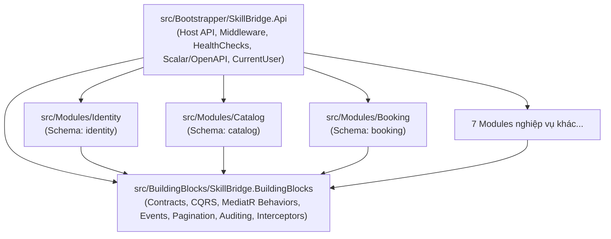

# Tài Liệu Hướng Dẫn Cài Đặt & Phát Triển (Setup & Developer Guide)

Tài liệu này dành cho tất cả thành viên (Developers, QA, DevOps) tham gia phát triển dự án **SkillBridge API**.  
Dự án được xây dựng theo mô hình **Modular Monolith** trên nền tảng **.NET 10** kết hợp phương pháp **Domain-Driven Design (DDD)**.

---

## Mục lục
1. [Tổng quan kiến trúc Modular Monolith](#1-tổng-quan-kiến-trúc-modular-monolith)
2. [Yêu cầu môi trường cài đặt (Prerequisites)](#2-yêu-cầu-môi-trường-cài-đặt-prerequisites)
3. [Khởi động hạ tầng cục bộ với Docker Compose](#3-khởi-động-hạ-tầng-cục-bộ-với-docker-compose)
4. [Cấu hình ứng dụng](#4-cấu-hình-ứng-dụng)
5. [Biên dịch và Chạy ứng dụng API](#5-biên-dịch-và-chạy-ứng-dụng-api)
6. [Tài liệu API tương tác & Kiểm thử nhanh](#6-tài-liệu-api-tương-tác--kiểm-thử-nhanh)
7. [Quy chuẩn Code & Quy trình CI trước khi tạo Pull Request](#7-quy-chuẩn-code--quy-trình-ci-trước-khi-tạo-pull-request)
8. [Hướng dẫn chi tiết: Thêm một Module mới](#8-hướng-dẫn-chi-tiết-thêm-một-module-mới)

---

## 1. Tổng quan kiến trúc Modular Monolith

Hệ thống được đóng gói triển khai dưới dạng **một tiến trình (Single Process)** nhưng mã nguồn được chia thành các Bounded Context (Module nghiệp vụ) hoàn toàn độc lập:



### Các trụ cột Enterprise trong `BuildingBlocks`:
1. **Contracts**: `IModule` và `ModuleDefinition` đóng gói trọn vẹn vòng đời và probe endpoint của từng module.
2. **CQRS**: `ICommand`, `IQuery`, `ICommandHandler`, `IQueryHandler` tích hợp sẵn Railway `Result<T>`.
3. **Behaviors**: `ValidationBehavior` (tự động chạy FluentValidation) và `LoggingBehavior` (đo lường hiệu năng).
4. **Security Context**: `ICurrentUser` bóc tách danh tính (UserId, Email, Roles) từ JWT Claims.
5. **Auditing & Interceptors**: `AuditInterceptor` (tự động gán thời gian/người tạo/sửa, chuyển xóa mềm) và `DispatchDomainEventsInterceptor` (gom và phát domain events).
6. **Events & Outbox**: `IIntegrationEvent`, `IEventBus`, `InMemoryEventBus`, `OutboxMessage` đảm bảo liên module không phụ thuộc trực tiếp.
7. **Pagination**: `PaginationParams` và `PagedResult<T>` thống nhất định dạng JSON phân trang cho toàn hệ thống.

### 3 Nguyên tắc bất biến (Golden Rules):
1. **Tuyệt đối không reference chéo giữa các Module**: Module `Booking` không được phép thêm project reference đến Module `Identity` hay `Catalog`.
2. **Cô lập dữ liệu (Schema Isolation)**: Mỗi module sở hữu riêng một PostgreSQL schema (ví dụ: `identity.users`, `booking.appointments`). Module này không được đọc/ghi trực tiếp vào schema của module khác.
3. **Giao tiếp liên module**:
   - Truy vấn đồng bộ (Sync): Sử dụng In-Memory Dispatcher hoặc Public Contracts interface.
   - Luồng nghiệp vụ bất đồng bộ (Async): Sử dụng **Integration Events** qua **RabbitMQ** với Transactional Outbox Pattern.

---

## 2. Yêu cầu môi trường cài đặt (Prerequisites)

Trước khi bắt đầu, đảm bảo máy bạn đã cài đặt:
- **.NET 10 SDK** (phiên bản `10.0.x` - kiểm tra bằng `dotnet --version`).
- **Docker Desktop** (hoặc Docker Engine + Docker Compose) để chạy database và message broker.
- **IDE khuyên dùng**:
  - Visual Studio 2022 (v17.12 trở lên)
  - VS Code (cài extension *C# Dev Kit*)
  - JetBrains Rider

---

## 3. Khởi động hạ tầng cục bộ với Docker Compose

Tất cả các dịch vụ phụ trợ cần thiết đã được cấu hình trong file `docker-compose.yml`.

### Lệnh khởi động:
```powershell
docker compose up -d
```

### Danh sách các dịch vụ & Cổng truy cập:
| Dịch vụ | Cổng Host | Tài khoản mặc định | Mục đích |
| :--- | :--- | :--- | :--- |
| **PostgreSQL 17** | `5432` | User: `skillbridge`<br/>Pass: `skillbridge`<br/>Database: `skillbridge` | Cơ sở dữ liệu chính lưu trữ theo từng schema của module |
| **RabbitMQ Management** | `5672` (AMQP)<br/>`15672` (Web UI) | User: `skillbridge`<br/>Pass: `skillbridge` | Dashboard quản lý message broker tại `http://localhost:15672` |
| **Redis 7** | `6379` | Không mật khẩu | Distributed caching & rate limiting |

### Các lệnh quản lý Docker hữu ích:
```powershell
# Xem trạng thái các container đang chạy
docker compose ps

# Xem log các dịch vụ
docker compose logs -f

# Dừng toàn bộ dịch vụ (giữ lại dữ liệu volume)
docker compose down

# Dừng và xoá sạch dữ liệu cũ
docker compose down -v
```

---

## 4. Cấu hình ứng dụng

`global.json` chấp nhận .NET SDK 10.0.100 trở lên trong dòng 10.0 (`latestFeature`); mã nguồn dùng C# 13. Không cần cài đúng SDK 10.0.400.

Database mới dùng **EF migrations làm nguồn tạo bảng duy nhất**. `scripts/init-db/01-init-schemas.sql` là blueprint tham khảo, không được Docker tự chạy. Nếu volume cũ đã chạy blueprint, không áp dụng chồng migrations hoặc xóa volume có dữ liệu: sao lưu và đối chiếu schema trước khi chuyển đổi. Dùng database trống riêng để phát triển/kiểm thử nếu chưa có phương án chuyển dữ liệu.

Database từng chạy `20260916144706_IdentityAuthentication` từ prototype `feat/dang` cũng cần chuyển đổi riêng: schema, vai trò, session và hash PBKDF2 khác bản hiện tại dùng BCrypt. Migration này chỉ hỗ trợ database mới hoặc nâng cấp `20260911052416_Initial_Identity` từ `main`; xem [phạm vi thay thế prototype](backend-progress.md#thay-thế-prototype-trên-featdang). Không xóa database cũ hay chạy chồng migrations.

Môi trường Development tự áp dụng migrations của Identity và Catalog. Production phải áp dụng migrations trước khi nhận traffic và đặt `Jwt__SecretKey` riêng (ít nhất 32 byte ngẫu nhiên); khóa mẫu chỉ có trong `appsettings.Development.json`. Probe `/health/ready` kiểm tra kết nối và migrations của hai module đã có persistence, chưa xác nhận RabbitMQ/Redis.

Cookie refresh luôn `Secure`; luồng login/refresh qua browser phải dùng HTTPS hoặc BFF HTTPS. HTTP local chỉ phù hợp với HTTP client kiểm thử có quản lý cookie rõ ràng.

Để sinh migration, chạy `dotnet tool restore --tool-manifest dotnet-tools.json`, rồi dùng `dotnet ef migrations add <Name> --project <ModuleProject> --startup-project src/Bootstrapper/SkillBridge.Api --context <ModuleDbContext> --output-dir Infrastructure/Migrations`. Chạy công cụ với `ASPNETCORE_ENVIRONMENT=Development` ở máy local; không đặt khóa JWT production vào câu lệnh hay mã nguồn.

1. **Biến môi trường**: Tạo file `.env` từ file mẫu:
   ```powershell
   Copy-Item .env.example .env
   ```
2. **File cấu hình `appsettings.Development.json`**:
   Dự án đã cấu hình sẵn ConnectionStrings trỏ thẳng vào các container Docker cục bộ:
   ```json
   {
     "ConnectionStrings": {
       "Database": "Host=localhost;Port=5432;Database=skillbridge;Username=skillbridge;Password=skillbridge"
     },
     "RabbitMq": {
       "Host": "localhost",
       "Username": "skillbridge",
       "Password": "skillbridge"
     }
   }
   ```

---

## 5. Biên dịch và Chạy ứng dụng API

Mở terminal tại thư mục gốc của dự án:

```powershell
# 1. Restore các package NuGet
dotnet restore

# 2. Biên dịch toàn bộ Solution
dotnet build

# 3. Khởi chạy dự án Host API
dotnet run --project src/Bootstrapper/SkillBridge.Api
```

Sau khi chạy thành công, console sẽ hiển thị địa chỉ lắng nghe (mặc định: `http://localhost:5000` hoặc cổng theo `launchSettings.json`).

---

## 6. Tài liệu API tương tác & Kiểm thử nhanh

Khi ứng dụng chạy ở môi trường `Development`, bạn có thể truy cập các đường dẫn sau:

- 📖 **Giao diện Scalar API (Swagger thế hệ mới)**:  
  👉 **`http://localhost:5000/scalar/v1`**  
  (Giao diện web trực quan, cho phép test trực tiếp các API của từng Module tương tự Postman).
- 📄 **OpenAPI JSON Specification**:  
  👉 `http://localhost:5000/openapi/v1.json`
- 💓 **Health Checks**:
  - `http://localhost:5000/health/live`: Kiểm tra tiến trình ứng dụng có đang sống hay không.
  - `http://localhost:5000/health/ready`: Kiểm tra độ sẵn sàng của hạ tầng (Database, RabbitMQ).
- 🔍 **Probe kiểm tra Module Identity**:
  - `http://localhost:5000/api/v1/identity/_module`: Kiểm tra trạng thái khả dụng của Module Identity.
  - `http://localhost:5000/api/v1/identity/users/me`: Test endpoint nghiệp vụ mẫu của User.
- 🆔 **Header `X-Correlation-ID`**:  
  Mọi phản hồi từ server đều tự động đính kèm header `X-Correlation-ID` trong Response Header giúp truy vết log lỗi.

---

## 7. Quy chuẩn Code & Quy trình CI trước khi tạo Pull Request

Ngoài build và format bên dưới, chạy `dotnet run --project tests/SkillBridge.Checks --configuration Release`. Kiểm thử PostgreSQL/HTTP thực tế, migration và cạnh tranh token: xem [hướng dẫn kiểm thử](../tests/SkillBridge.Checks/README.md). CI chạy thêm các kiểm tra này với PostgreSQL 17.

Dự án áp dụng quy trình kiểm tra chất lượng code tự động trên GitHub Actions.  
Trước khi `git push` hoặc tạo PR, bạn **bắt buộc phải chạy 2 lệnh sau trên máy của mình**:

```powershell
# 1. Tự động kiểm tra định dạng code theo chuẩn .editorconfig
dotnet format SkillBridge.slnx --verify-no-changes

# 2. Biên dịch chế độ Release và chặn toàn bộ Warning (Warn as Error)
dotnet build SkillBridge.slnx --configuration Release --warnaserror
```

> [!WARNING]
> Nếu một trong hai lệnh trên báo lỗi đỏ, GitHub Actions CI sẽ tự động từ chối (Reject) Pull Request của bạn.  
> Để tự động sửa định dạng code bị lệch, hãy chạy: `dotnet format SkillBridge.slnx`.

---

## 8. Hướng dẫn chi tiết: Thêm một Module mới

Khi được phân công phát triển một Module mới (ví dụ: `Catalog`), hãy tuân thủ đúng các bước sau:

### Bước 1: Tạo project classlib cho module
```powershell
dotnet new classlib -o src/Modules/Catalog/SkillBridge.Modules.Catalog
```
Xoá file `Class1.cs` mặc định.

### Bước 2: Cấu hình file `.csproj` của Module
Mở `src/Modules/Catalog/SkillBridge.Modules.Catalog/SkillBridge.Modules.Catalog.csproj` và sửa thành:
```xml
<Project Sdk="Microsoft.NET.Sdk">

  <ItemGroup>
    <FrameworkReference Include="Microsoft.AspNetCore.App" />
  </ItemGroup>

  <ItemGroup>
    <!-- Chỉ được reference tới BuildingBlocks, TUYỆT ĐỐI không reference module khác -->
    <ProjectReference Include="..\..\..\BuildingBlocks\SkillBridge.BuildingBlocks\SkillBridge.BuildingBlocks.csproj" />
  </ItemGroup>

</Project>
```

### Bước 3: Thêm module vào Solution
```powershell
dotnet sln SkillBridge.slnx add src/Modules/Catalog/SkillBridge.Modules.Catalog/SkillBridge.Modules.Catalog.csproj --solution-folder /src/Modules/
```

### Bước 4: Tạo cấu trúc 4 tầng nội bộ trong Module
Tạo các thư mục:
```text
SkillBridge.Modules.Catalog/
├── Domain/          <-- Chứa Entities, Value Objects, Domain Events, Domain Errors
├── Application/     <-- Chứa CQRS Commands, Queries, Validators, DTOs
├── Infrastructure/  <-- Chứa CatalogDbContext (Schema: "catalog"), Repositories
├── Endpoints/       <-- Chứa Minimal API endpoint mappings
└── CatalogModule.cs <-- Định nghĩa Module kế thừa ModuleDefinition
```

### Bước 5: Viết file định nghĩa Module `{ModuleName}Module.cs`
Ví dụ tạo file `CatalogModule.cs`:
```csharp
using Microsoft.AspNetCore.Builder;
using Microsoft.AspNetCore.Routing;
using Microsoft.Extensions.Configuration;
using Microsoft.Extensions.DependencyInjection;
using SkillBridge.BuildingBlocks.Contracts;

namespace SkillBridge.Modules.Catalog;

public sealed class CatalogModule : ModuleDefinition
{
    public override string Name => "Catalog";
    public override string RoutePrefix => "catalog";

    public override void AddServices(IServiceCollection services, IConfiguration configuration)
    {
        // Đăng ký DbContext và services của riêng Module Catalog tại đây
    }

    public override void MapEndpoints(IEndpointRouteBuilder endpoints)
    {
        base.MapEndpoints(endpoints); // Tạo probe /api/v1/catalog/_module

        var group = endpoints.MapGroup($"/api/v1/{RoutePrefix}").WithTags(Name);
        // Map các API của module tại đây
    }
}
```

### Bước 6: Kết nối Module vào Bootstrapper
1. Thêm reference từ API vào Module mới:
   ```powershell
   dotnet add src/Bootstrapper/SkillBridge.Api/SkillBridge.Api.csproj reference src/Modules/Catalog/SkillBridge.Modules.Catalog/SkillBridge.Modules.Catalog.csproj
   ```
2. Mở file [Program.cs](file:///d:/Projects/skillbridge-api/src/Bootstrapper/SkillBridge.Api/Program.cs), thêm module mới vào danh sách `modules`:
   ```csharp
   List<IModule> modules = [
       new IdentityModule(),
       new CatalogModule() // <-- Module mới ở đây
   ];
   ```

---

## 9. Xử lý sự cố thường gặp (Troubleshooting)

### 9.1. Lỗi khóa file khi biên dịch (MSB3027 / MSB3021)
**Triệu chứng**:
```text
error MSB3027: Could not copy "...SkillBridge.BuildingBlocks.dll" to "...". Exceeded retry count of 10. Failed. The file is locked by: "SkillBridge.Api (PID)"
error MSB3021: Unable to copy file... The process cannot access the file because it is being used by another process.
```
**Nguyên nhân**: Ứng dụng `SkillBridge.Api` đang chạy ngầm hoặc đang chạy ở một cửa sổ terminal khác, dẫn đến tiến trình hệ điều hành chiếm quyền ghi file `.dll`.

**Cách xử lý nhanh (PowerShell)**:
```powershell
# Cách 1: Tắt toàn bộ tiến trình SkillBridge.Api đang chạy ngầm
Get-Process -Name "SkillBridge.Api" -ErrorAction SilentlyContinue | Stop-Process -Force

# Cách 2: Hoặc dùng taskkill
taskkill /F /IM SkillBridge.Api.exe
```
Sau đó chạy lại lệnh biên dịch `dotnet build`.

---

### 9.2. Lỗi không kết nối được PostgreSQL khi chạy ứng dụng
**Triệu chứng**: `Npgsql.NpgsqlException: Connection refused` hoặc `Timeout during MigrateAsync`.

**Cách xử lý**:
1. Đảm bảo Docker Desktop đang chạy.
2. Kiểm tra container PostgreSQL bằng `docker compose ps`. Nếu chưa chạy, gõ:
   ```powershell
   docker compose up -d
   ```
3. Đảm bảo file `.env` đã có chuỗi kết nối chuẩn:
   ```env
   ConnectionStrings__Database=Host=localhost;Port=5432;Database=skillbridge;Username=skillbridge;Password=skillbridge
   ```

---

*Tài liệu được quản lý bởi DevOps Leader. Mọi thắc mắc hoặc đề xuất cải tiến vui lòng tạo Issue trên Repository.*
