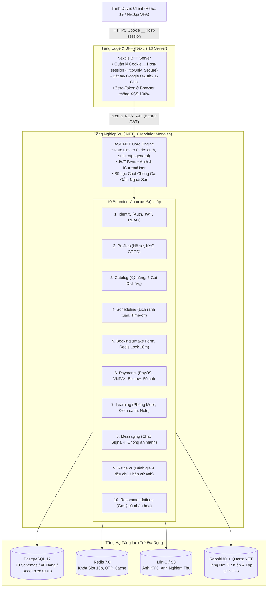
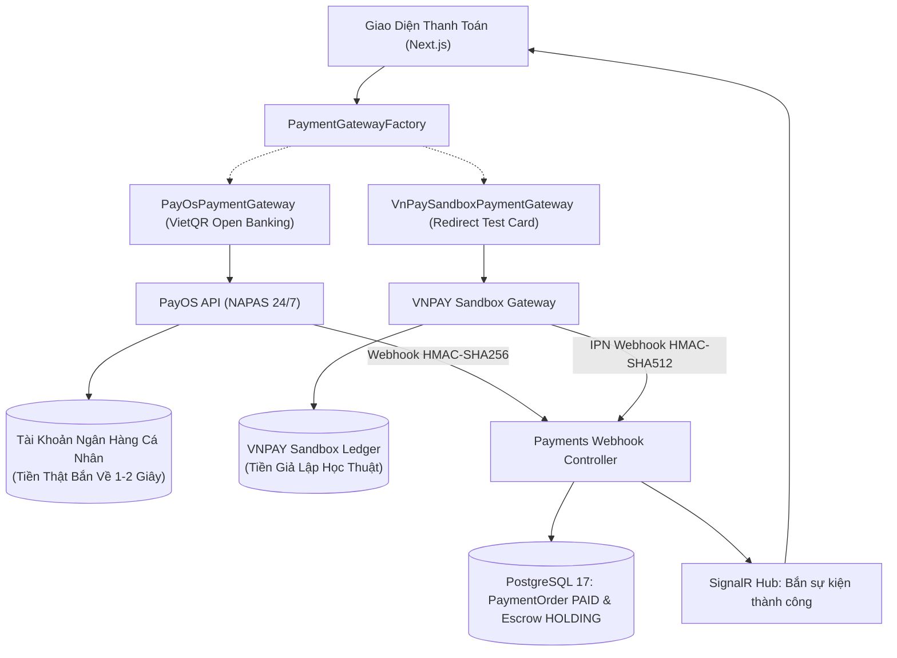

# Tài Liệu Thiết Kế Tổng Quan Hệ Thống (System Architecture Overview)

Tài liệu này cung cấp bức tranh toàn cảnh về kiến trúc hệ thống, ranh giới nghiệp vụ (Bounded Contexts), quy chuẩn dữ liệu và luồng giao tiếp của nền tảng **SkillBridge** (Full-stack: Next.js 16 BFF + .NET 10 Modular Monolith + PostgreSQL 17 + Redis 7).  
Mọi kỹ sư (Backend, Frontend, DevOps, QA) tham gia dự án cần nắm vững tài liệu này trước khi lập trình hoặc thiết kế tính năng mới.

Tài liệu thiết kế chi tiết bản in Microsoft Word: 👉 [`SkillBridge_Master_System_Architecture_and_Design_v4.docx`](../../SkillBridge_Master_System_Architecture_and_Design_v4.docx)

---

## 1. Tầm nhìn & Mô hình Nghiệp vụ (Trust Broker Marketplace)

**SkillBridge** là một "Thị trường Niềm Tin" (Trust Broker Marketplace) kết nối giữa Chuyên gia công nghệ (Mentor) và Người học/Lập trình viên đang đi làm (Mentee).  
Nền tảng vận hành theo 5 giai đoạn khép kín:
1. **Khám phá (Discovery)**: Mentee tìm kiếm theo **Gói Kết Quả Cụ Thể (Productized Services)** như *Review CV Chuẩn ATS*, *Mock Interview 1-1*, *Lộ trình Backend*.
2. **Khảo sát & Đặt lịch (Intake Form & Booking)**: Mentee bắt buộc điền **Intake Form 3 câu hỏi** và chọn khung giờ rảnh (Slot). Hệ thống kích hoạt **Khóa nguyên tử Redis 10 phút** (`SET slot:lock {id} EX 600 NX`) chống giữ chỗ dạo.
3. **Thanh toán đôi chuẩn Fintech (Dual Payment Gateway)**: Hỗ trợ linh hoạt:
   - **PayOS (VietQR NAPAS 24/7)**: Tiền thật nổ thẳng vào tài khoản ngân hàng cá nhân của Developer/Admin trong 1–2 giây, Webhook HMAC-SHA256, SignalR cập nhật UI tức thì.
   - **VNPAY Sandbox**: Chuyển hướng nhập thẻ ATM test NCB (`9704198526191432198`), phục vụ hội đồng chấm đồ án học thuật.
4. **Học tập & Nghiệm thu (Learning Session & Proof)**: Học qua Google Meet, Mentor chụp ảnh màn hình nghiệm thu nộp lên MinIO/S3.
5. **Két Ký Quỹ Escrow & Đánh Giá (Escrow & Trust)**: Tiền được bảo vệ trong két Escrow, giải ngân theo cột mốc (Milestone Release) sau 24h không có khiếu nại (chu kỳ T+3), mentee đánh giá review phân tầng.

---

## 2. Kiến trúc Tổng thể: C4 Container & Phân Tầng Hệ Thống



### 3 Luật Bất Biến của Kiến Trúc (Architectural Invariants):
1. **Cấm tuyệt đối Reference chéo giữa các Module**:
   - `SkillBridge.Modules.Booking` **KHÔNG ĐƯỢC PHÉP** reference tới `SkillBridge.Modules.Identity` hay `Payments`.
   - Các module chỉ giao tiếp bằng mã định danh `Guid` trần (Decoupled GUID keys) và gửi Integration Events.
2. **Cô lập dữ liệu tuyệt đối (Data Isolation)**:
   - Mỗi module sở hữu riêng một PostgreSQL Schema (`identity.*`, `booking.*`, `payments.*`).
   - Tuyệt đối **không tạo Khóa Ngoại vật lý (Physical Foreign Key)** nối chéo giữa các schema.
3. **Mô hình Zero-Token In Browser**:
   - Trình duyệt **hoàn toàn không lưu trữ Access Token hay Refresh Token** trong `localStorage` hay JavaScript memory.
   - Next.js BFF Server đóng vai trò Token Handler, mã hóa phiên vào Cookie bảo mật cao `__Host-session` (`HttpOnly`, `Secure`, `SameSite=Strict`).

---

## 3. Kiến Trúc Thanh Toán Đôi (Dual Payment Gateway Architecture)

Hệ thống áp dụng **Strategy Pattern** và **Factory Pattern** cho phân hệ Payments:



| Tiêu Chí | VNPAY Sandbox (Demo) | PayOS (VietQR) |
| :--- | :--- | :--- |
| **Bản chất dòng tiền** | Tiền giả lập học thuật (Sandbox). | Tiền thật chuyển khoản liên ngân hàng NAPAS 24/7. |
| **Điểm đến dòng tiền** | Không vào đâu cả (Lưu log test của VNPAY). | **Bắn thẳng vào tài khoản ngân hàng cá nhân** của Developer/Admin. |
| **Phương thức thanh toán**| Nhập số thẻ NCB test (`9704198526191432198`). | Mở App ngân hàng bất kỳ quét mã QR động. |
| **Chữ ký số** | HMAC-SHA512 (`vnp_SecureHash`). | HMAC-SHA256 (Checksum Key PayOS). |
| **Ứng dụng đồ án** | Báo cáo, kiểm tra luồng cổng truyền thống cho Thầy/Cô. | Live demo quét mã 2k, 5k nổ tiền thật tạo ấn tượng thực chiến. |

---

## 4. Cấu trúc Chuẩn 4 Tầng Nội Bộ Của Mỗi Module (.NET 10)

Mỗi Module là một project độc lập tuân thủ Clean Architecture:

```text
src/Modules/{ModuleName}/SkillBridge.Modules.{ModuleName}/
│
├── Domain/                         <-- Tầng Lõi (Zero Dependency)
│   ├── {Entity}.cs                 <-- AggregateRoot<TId> hoặc Entity<TId>
│   ├── Events/                     <-- Domain Events nội bộ
│   └── Errors/                     <-- Error codes nghiệp vụ
│
├── Application/                    <-- Tầng Ứng Dụng (CQRS MediatR)
│   ├── Commands/                   <-- Use cases thay đổi dữ liệu
│   ├── Queries/                    <-- Use cases truy vấn dữ liệu
│   ├── Validators/                 <-- FluentValidation rules
│   └── DTOs/                       <-- Request / Response DTOs
│
├── Infrastructure/                 <-- Tầng Hạ Tầng
│   ├── Data/
│   │   ├── {Name}DbContext.cs      <-- EF Core DbContext, Schema riêng biệt
│   │   └── Configurations/         <-- Fluent API mappings
│   ├── Adapters/                   <-- Payment Gateway, Third-party clients
│   └── Migrations/                 <-- EF Core Migrations
│
├── Endpoints/                      <-- Tầng Giao Tiếp (Minimal APIs)
│   └── {Feature}Endpoints.cs       <-- Ánh xạ HTTP Routes vào MediatR Pipeline
│
└── {Name}Module.cs                 <-- Điểm đăng ký DI (Kế thừa ModuleDefinition)
```

---

## 5. Quy Chuẩn An Ninh Phòng Thủ Đa Tầng (OWASP Top 10)

1. **SQL Injection**: 100% truy vấn được tham số hóa thông qua EF Core 10 LINQ queries.
2. **IDOR Prevention**: Mọi API cập nhật tài nguyên đều kiểm tra quyền sở hữu `ICurrentUser.UserId == entity.OwnerId`.
3. **Race Condition Prevention**: Số dư ví và trạng thái thanh toán dùng khóa bi quan `SELECT FOR UPDATE` kết hợp `xmin` Optimistic Concurrency.
4. **Webhook Security**: Kiểm tra bắt buộc Chữ ký số (HMAC-SHA256 / SHA512), Kiểm tra Timestamp (< 300s chống Replay Attack), và Idempotency Key qua bảng `payment_webhooks_audit`.
5. **Anti-Platform Bypass (Chống ăn mảnh)**: Lọc nội dung chat tự động bắt cờ các mẫu SĐT, Zalo, Số tài khoản ngân hàng để bảo vệ giao dịch qua sàn.
