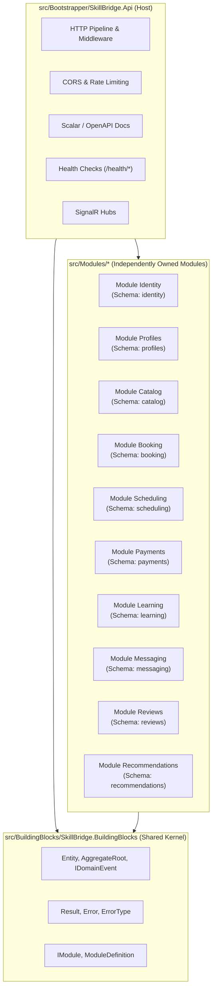
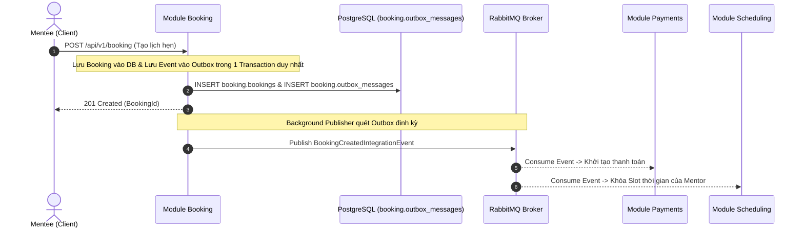

# Tài Liệu Thiết Kế Tổng Quan Hệ Thống (System Architecture Overview)

Tài liệu này cung cấp bức tranh toàn cảnh về kiến trúc hệ thống, ranh giới nghiệp vụ (Bounded Contexts), quy tắc dữ liệu và luồng giao tiếp của nền tảng **SkillBridge API**.  
Mọi kỹ sư (Backend, DevOps, QA, Frontend) tham gia dự án cần nắm vững tài liệu này trước khi lập trình hoặc thiết kế tính năng mới.

---

## 1. Tầm nhìn & Mô hình Nghiệp vụ (Business Domain)

**SkillBridge** là nền tảng kết nối người hướng dẫn (Mentor) và người học (Mentee) trong lĩnh vực công nghệ và kỹ năng mềm.  
Nền tảng hỗ trợ toàn bộ vòng đời của một buổi cố vấn:
1. **Khám phá (Discovery)**: Mentee tìm kiếm Mentor theo kỹ năng, đánh giá và giá theo giờ (Catalog & Reviews & Recommendations).
2. **Đặt lịch (Booking & Scheduling)**: Chọn khung giờ trống của Mentor, tạo lịch hẹn (Booking & Scheduling).
3. **Thanh toán (Payments)**: Xử lý giao dịch đặt cọc / thanh toán buổi học (Payments).
4. **Học tập (Learning & Messaging)**: Tạo phòng học, trao đổi tài liệu và chat realtime (Learning & Messaging).
5. **Phản hồi (Reviews & Recommendations)**: Đánh giá chất lượng sau buổi học, cập nhật xếp hạng Mentor.

---

## 2. Kiến trúc Tổng thể: Modular Monolith

Dự án áp dụng mô hình **Modular Monolith** trên nền tảng **.NET 10** theo chuẩn **Domain-Driven Design (DDD)**.



### 3 Luật Bất Biến của Hệ Thống (Architectural Invariants):
1. **Cấm tuyệt đối Project Reference chéo giữa các Module**:
   - `SkillBridge.Modules.Booking` **KHÔNG ĐƯỢC PHÉP** reference tới `SkillBridge.Modules.Identity` hay bất kỳ module nào khác.
   - Các module chỉ được reference duy nhất tới `SkillBridge.BuildingBlocks`.
2. **Cô lập dữ liệu tuyệt đối (Data Isolation)**:
   - Mỗi module sở hữu riêng một PostgreSQL Schema (`identity.*`, `booking.*`).
   - Tuyệt đối **không tạo Khóa Ngoại (Foreign Key)** nối chéo giữa các schema.
   - Giữa các module chỉ lưu **ID dạng `Guid` trần** (Unconstrained Foreign Identifier).
3. **Tính toàn vẹn giao dịch (Eventual Consistency)**:
   - Không thực hiện distributed transaction liên module.
   - Giao tiếp liên module dựa trên **Integration Events** phát qua **RabbitMQ** với **Transactional Outbox Pattern**.

---

## 3. Bản đồ Chi tiết 10 Bounded Contexts (10 Modules)

| STT | Module | Schema DB | Trách nhiệm chính (Responsibility) | Thực thể sở hữu (Entities) | Integration Events phát ra |
| :---: | :--- | :--- | :--- | :--- | :--- |
| 1 | **Identity** | `identity` | Xác thực, phân quyền, đăng ký, đăng nhập, cấp phát JWT Tokens. | `User`, `Role`, `RefreshToken` | `UserRegisteredIntegrationEvent` |
| 2 | **Profiles** | `profiles` | Hồ sơ chi tiết của Mentor (kỹ năng, kinh nghiệm, giá/giờ) và Mentee (mục tiêu học tập). | `MentorProfile`, `MenteeProfile`, `Certificate` | `MentorProfileUpdatedIntegrationEvent` |
| 3 | **Catalog** | `catalog` | Cây danh mục kỹ năng, chủ đề mentoring, tag tìm kiếm. | `Category`, `SkillTopic`, `Tag` | `SkillCreatedIntegrationEvent` |
| 4 | **Scheduling**| `scheduling`| Lịch biểu sẵn sàng (Availability Slots) của Mentor, ngày nghỉ, lịch bận. | `ScheduleSlot`, `TimeOff` | `SlotBookedIntegrationEvent`, `SlotReleasedIntegrationEvent` |
| 5 | **Booking** | `booking` | Quy trình đặt lịch hẹn: Pending ➔ Confirmed ➔ Completed / Cancelled. | `BookingAppointment`, `BookingHistory` | `BookingCreatedIntegrationEvent`, `BookingConfirmedIntegrationEvent`, `BookingCancelledIntegrationEvent` |
| 6 | **Payments** | `payments` | Xử lý thanh toán, ví người dùng (Wallet), giữ tiền (Escrow), hoàn tiền (Refund), thanh toán cho Mentor. | `PaymentTransaction`, `Wallet`, `PayoutInvoice` | `PaymentCompletedIntegrationEvent`, `PaymentRefundedIntegrationEvent` |
| 7 | **Learning** | `learning` | Quản lý buổi học trực tuyến: phòng video call, tài liệu chia sẻ, ghi chú buổi học. | `LearningSession`, `SessionMaterial`, `SessionNote` | `SessionStartedIntegrationEvent`, `SessionCompletedIntegrationEvent` |
| 8 | **Messaging**| `messaging` | Tin nhắn trao đổi trực tiếp giữa Mentor và Mentee, danh sách hội thoại, SignalR chat. | `Conversation`, `Message`, `MessageAttachment` | `MessageSentIntegrationEvent` |
| 9 | **Reviews** | `reviews` | Đánh giá sao (1-5 sao) và nhận xét sau buổi học, tính điểm uy tín của Mentor. | `Review`, `MentorRatingSummary` | `ReviewSubmittedIntegrationEvent` |
| 10| **Recommendations**| `recommendations`| Thuật toán gợi ý Mentor phù hợp nhất cho Mentee dựa trên kỹ năng, lịch sử và đánh giá. | `RecommendationCache`, `MentorScoreVector` | (Lắng nghe events từ các module khác để tính điểm) |

---

## 4. Chiến lược Giao tiếp Liên Module (Communication Patterns)

Dự án áp dụng kết hợp 2 hình thức giao tiếp theo [ADR 0002](adr/0002-communication-patterns.md):



### A. Truy vấn đồng bộ (In-Memory Query / Contracts)
- Khi một Module cần đọc dữ liệu nhanh từ Module khác mà không làm gián đoạn luồng nghiệp vụ.
- Được thực hiện qua Interface/Contract dự kiến đặt trong thư viện Contracts hoặc In-Memory Mediator mà **không để lộ Entity nội bộ**.

### B. Luồng nghiệp vụ bất đồng bộ (Async Event-Driven qua Outbox + RabbitMQ)
- Mọi thay đổi dữ liệu liên quan đến nhiều module bắt buộc phải dùng **Transactional Outbox Pattern**:
  1. Khi Module `Booking` tạo đơn đặt lịch, nó ghi bản ghi vào bảng `booking.bookings` đồng thời ghi `BookingCreatedIntegrationEvent` vào bảng `booking.outbox_messages` **trong cùng một Database Transaction**.
  2. Background Worker (Outbox Processor) đọc outbox và gửi message sang RabbitMQ.
  3. Module nhận (như `Payments`, `Scheduling`) nhận message, kiểm tra bảng `inbox_messages` (Idempotency Key) để đảm bảo không xử lý trùng lặp.

---

## 5. Cấu trúc Chuẩn 4 Tầng Nội Bộ Của Mỗi Module

Mỗi Module là một project độc lập tuân thủ Clean Architecture:

```text
src/Modules/{ModuleName}/SkillBridge.Modules.{ModuleName}/
│
├── Domain/                         <-- Tầng Lõi (Không phụ thuộc tầng nào)
│   ├── {Entity}.cs                 <-- Kế thừa AggregateRoot<TId> hoặc Entity<TId>
│   ├── Events/                     <-- Domain Events nội bộ (IDomainEvent)
│   └── Errors/                     <-- Mã lỗi nghiệp vụ cụ thể của module
│
├── Application/                    <-- Tầng Ứng Dụng (Use Cases)
│   ├── Commands/                   <-- Use cases thay đổi dữ liệu (CQRS)
│   ├── Queries/                    <-- Use cases đọc dữ liệu (CQRS)
│   └── DTOs/                       <-- Request / Response DTOs
│
├── Infrastructure/                 <-- Tầng Hạ Tầng (Persistence & External)
│   ├── Data/
│   │   ├── {Name}DbContext.cs      <-- Kế thừa DbContext, gán Schema riêng
│   │   └── Configurations/         <-- IEntityTypeConfiguration<T> Fluent API
│   └── Migrations/                 <-- Thư mục chứa EF Core Migrations
│
├── Endpoints/                      <-- Tầng Giao Tiếp (HTTP Minimal APIs)
│   └── {Feature}Endpoints.cs       <-- Map endpoints nhóm theo /api/v1/{module}/...
│
└── {Name}Module.cs                 <-- Điểm neo Module (Kế thừa ModuleDefinition)
```

---

## 6. Chiến lược Quản lý Database & DevOps Migration Bundle

Dự án chọn **Giải pháp 1: EF Core Migration Bundles**:

### Vì sao chọn Migration Bundle?
1. **Zero-downtime & Multi-replica safe**: Đóng gói các file migration thành file nhị phân thực thi độc lập (executable binary). File này được chạy trước khi Pods/Containers mới khởi động (chạy qua K8s InitContainer hoặc bước CI/CD Deploy).
2. **Không gây Race Condition**: Không kích hoạt migrate tự động khi app boot trên Production.
3. **Lịch sử riêng biệt**: Mỗi module tự quản lý bảng `__EFMigrationsHistory` trong schema của chính mình:
   ```csharp
   npgsqlOptions.MigrationsHistoryTable("__EFMigrationsHistory", "identity");
   ```

### Lệnh đóng gói Bundle mẫu cho CI/CD:
```powershell
dotnet ef migrations bundle `
  -p src/Modules/Identity/SkillBridge.Modules.Identity `
  -s src/Bootstrapper/SkillBridge.Api `
  -c IdentityDbContext `
  -o ./bundles/identity-migrator.exe `
  -f
```

---

*Tài liệu này được ban hành bởi DevOps & Architecture Lead. Mọi đề xuất thay đổi kiến trúc cần được thảo luận qua ADR (Architecture Decision Record).*
